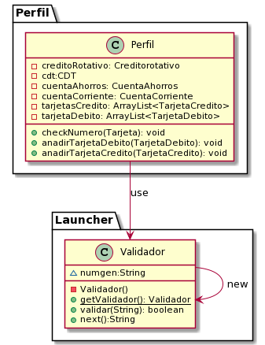

## Banco PDUSA

El banco PDUSA ha creado portafolios acorde a su publico. los cuales esperan mejorar el onboarding y retencion de clientes

### Perfiles de clientes

18

> **Resticcion/especificacion:** perosnas que recien cumplen 18 anios
>
> **Cuenta de Ahorros:** Verdadero (Habilitada)
>
> **Cuenta Corriente:** Falso (inhabilidata)
>
> **Tarjeta de debito:** limite de transaccion de $200.000
>
> **Tarjeta de credito:** credito limite de $1.000.000
>
> **CDT:** inicial a 5 anios con una apertura minima de $1.000.000
>
> **Credito rotativo:** inhabilitada ($0 para saber que existe)


laboral


> **Restricion/especificacion:** Personas en el mundo laboral
>
> **Cuenta de Ahorros:** habilitada
>
> **Cuenta corriente:** habilitada
>
> **Tarjeta de debito:** limite de transaccion de $2.000.000
>
> **Tarjeta de credito:** limite de $3.500.000
>
> **CDT:** inicial a 5 anios con una apertura minima de $1.000.000
>
> **credito rotativo:** habilitada con un limite de $2.000.000


Menor


> **Restricion/especificacion:** personas menores de edad que desean ingresar al mundo financiero
>
> **Cuenta de Ahorros:** Habilitada
>
> **Cuenta corriente:** Deshabilitada
>
> **Tarjeta de debito:** debito con limite de $100.000
>
> **Tarjeta de credito:** habilitada limite base $1.000.000
>
> **CDT:** inicia 2 anios con apertura de $200.000
>
> **credito rotativo:** inhabilitada ($0 para poder activarla a futuro)


Millonario


> **Restricion/especificacion:** Personas con una gran capidad de endeudamiento e ingresos
>
> **Cuenta de Ahorros:** habilitada
>
> **Cuenta corriente:** habilitada
>
> **Tarjeta de debito:** limite de $20.000.000
>
> **Tarjeta de credito:** limite de $950.000.000
>
> **CDT:** para 20 anios con apertura de $1.000.000.000
>
> **credito rotativo:** habilitada con limite de $2.000.000.000


|**Requerimientos adicionales**|
|---|
|Las creacion siempre tendra los mismo pasos|
|duplicacion de servicios|
|Los numero de las tarjetas se deben verificar con el algoritmo de luhn|

## SOLID

### Principio de unica responsabilidad 

una clase tiene una sola responsabilidad

```java
public class Portafolio18Factory implements IPortafolioFactory {
   
    public Portafolio darPortafolio(){
     //build Portafolio
     }
}
```
En este ejemplo se observa como las fabricas de los portafolios solo tiene una responsabilidad, la cual es entregar un portafolio. De igual manera, este otro ejemplo muestra como la fabrica de los servicios solo tiene la resposabilidad de crear el servicio.

```java
public class CreditoRotativoFactory implements IProductoFactory{
    public Producto darProducto(){
        return new CreditoRotativo();
    }
    public Producto darProducto(String s){
        return new CreditoRotativo();
    }
    
}
```

### Principio de abierto/cerrado

agregar nuevo codigo evitando modificar el antiguo

```java
//code example
public class PortafolioFactory {
     public IPortafolioFactory darFactory(String c){
        Map<String, IPortafolioFactory> map = new HashMap<String,  IPortafolioFactory>();
        map.put("18",new Portafolio18Factory());
        map.put("laboral",new PortafolioLaboralFactory());
        map.put("menor",new PortafolioMenorFactory());
        map.put("megaMillonario",new PortafolioMegaMillonarioFactory()); 
        return map.get(c);
    }
}
```

para no usar if y violar el principio se prefirio el uso de maps, ya que se agregaria codigo nuevo y se mantendria el antiguo.

### Principio de sustitucion de Liskov

todas las subclases se debe comportar como la clase padre

```java
public abstract class Tarjeta extends Producto  {
    private String numero = "";
    public Tarjeta(){}
    //...
    @Override
    public String toString() {
        return "Tarjeta{" + "numero=" + numero + '}';
    }
    
}

public class TarjetaCredito  extends Tarjeta{
    
    
    private float credito=0; //Total debido en positivo
    private float cupo=1000000;
    //...
    public Producto Clone() {
        return new TarjetaCredito(this);
    }
    
    
}

```

Cada uno de los productos cumple con la sustitución de liskov ya que todas las subclases se comportan como la clase, ya que cada producto está definido y no cae en errores por generalizaciones.

### Segregacion de interfaces

fragmentear las Grandes clases para no estarla modificando

```java
public abstract class Producto {
    private boolean activo = false;
    public String idCliente;
    public String nombreCliente;
    //...
    public void checkActivo() {
        if (!this.isActivo()) {
            throw new ArithmeticException("La cuenta no esta activa!");

        }

    }
}
public abstract class Cuenta extends Producto {   
    private float saldo;
    //...
    public void meterDinero(float a) {
        this.checkActivo();
        
        if (a < 0) {
            System.out.println("ERROR: la cantidad a retirar no puede ser negativa");
        } else {
            this.setSaldo(this.getSaldo() + a);
        }

    }

}
public class CuentaAhorros extends Cuenta {

    private float tasaInteres;

    public void generarInteres() {
        this.checkActivo();
        this.setSaldo(this.getSaldo() * (1 + this.tasaInteres));
    }
    //...
    public CuentaAhorros Clone(){
        return new CuentaAhorros(this);
    }
}
```

Las funcionalidades de los productos se fragmentan para reducir el tamaño de la clase a implementar y por otro lado no estar utilizando porciones de una función grande.

### Inversion de dependencias

los modulos altos no deben depender de los bajos, preferiblemente depender de interfaces

```java
public interface IPortafolioFactory {
    public Portafolio darPortafolio();
    
}

public class PortafolioFactory {
     public IPortafolioFactory darFactory(String c){
        Map<String, IPortafolioFactory> map = new HashMap<String,  IPortafolioFactory>();
        map.put("18",new Portafolio18Factory());
        map.put("laboral",new PortafolioLaboralFactory());
        map.put("menor",new PortafolioMenorFactory());
        map.put("megaMillonario",new PortafolioMegaMillonarioFactory()); 
        return map.get(c);   
    }   
}
```

En este caso, podemos observar el principio ya que PortafolioFactory no depende de cada gran clase sino de una interfaz que la relaciona con la clase para la creación de los servicios

## Patrones

### Patron fabrica


se hace una fabrica de servicios del banco

### Patron de fabrica abstracta


fabrica las facbricas de servicios.

### Patron constructor


Se construyen los componenetes del perfil. en donde, las fabricas de perfiles creara los atributos del perfil segun lo requiera

### Patron Singleton



El validador es una instancia que no puede ser creada mas de una vez, de ese modo para hacer uso de ella se llama a la funcion getValidador que creara o entregara el validador creado con anterioridad segun sea el caso

### Patron prototipo


Clona los servicios para ahorra tiempo creando.

## Diagrama de clases


