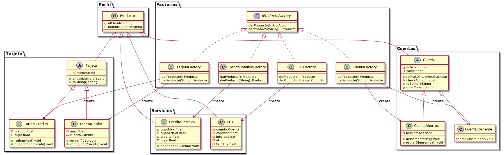

## Banco PDUSA

El banco PDUSA ha creado portafolios acorde a su publico. los cuales esperan mejorar el onboarding y retencion de clientes

### Perfiles de clientes

18

> **Resticcion/especificacion:** perosnas que recien cumplen 18 anios
>
> **Cuenta de Ahorros:** Verdadero (Habilitada)
>
> **Cuenta Corriente:** Falso (inhabilidata)
>
> **Tarjeta de debito:** limite de transaccion de $200.000
>
> **Tarjeta de credito:** credito limite de $1.000.000
>
> **CDT:** inicial a 5 anios con una apertura minima de $1.000.000
>
> **Credito rotativo:** inhabilitada ($0 para saber que existe)


laboral


> **Restricion/especificacion:** Personas en el mundo laboral
>
> **Cuenta de Ahorros:** habilitada
>
> **Cuenta corriente:** habilitada
>
> **Tarjeta de debito:** limite de transaccion de $2.000.000
>
> **Tarjeta de credito:** limite de $3.500.000
>
> **CDT:** inicial a 5 anios con una apertura minima de $1.000.000
>
> **credito rotativo:** habilitada con un limite de $2.000.000


Menor


> **Restricion/especificacion:** -
>
> **Cuenta de Ahorros:** -
>
> **Cuenta corriente:** -
>
> **Tarjeta de debito:** -
>
> **Tarjeta de credito:** -
>
> **CDT:** -
>
> **credito rotativo:** -


Millonario


> **Restricion/especificacion:** -
>
> **Cuenta de Ahorros:** -
>
> **Cuenta corriente:** -
>
> **Tarjeta de debito:** -
>
> **Tarjeta de credito:** -
>
> **CDT:** -
>
> **credito rotativo:** -


|**Requerimientos adicionales**|
|---|
|Las creacion siempre tendra los mismo pasos|
|duplicacion de servicios|
|Los numero de las tarjetas se deben verificar con el algoritmo de luhn|

## SOLID

### Principio de unica responsabilidad 

una clase tiene una sola responsabilidad

```java
//code example
```

--**Explication**--

### Principio de abierto/cerrado

agregar nuevo codigo evitando modificar el antiguo

```java
//code example
```

--**Explication**--

### Principio de sustitucion de Liskov

todas las subclases se debe comportar como la clase padre

```java
//Code example
```

--**Explication**--

### Segregacion de interfaces

fragmentear las Grandes clases para no estarla modificando

```java
//Code example
```

--**Explication**--

### Inversion de dependencias

los modulos altos no deben depender de los bajos, preferiblemente depender de interfaces

```java
//Code example
```

--**Explication**--

## Patrones

### Patron fabrica



se hace una fabrica de servicios del banco

### Patron de fabrica abstracta

DIAGRAMA

Explicacion del uso

### Patron constructor


Se construyen los componenetes del perfil. en donde, las fabricas de perfiles creara los atributos del perfil segun lo requiera

### Patron Singleton


El validador es una instancia que no puede ser creada mas de una vez, de ese modo para hacer uso de ella se llama a la funcion getValidador que creara o entregara el validador creado con anterioridad segun sea el caso

### Patron prototipo

DIAGRAMA

Explicacion del uso

## Diagrama de clases

diagramita
