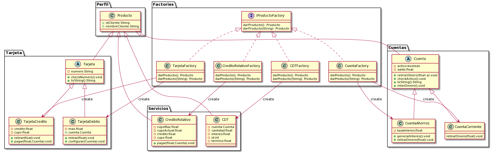
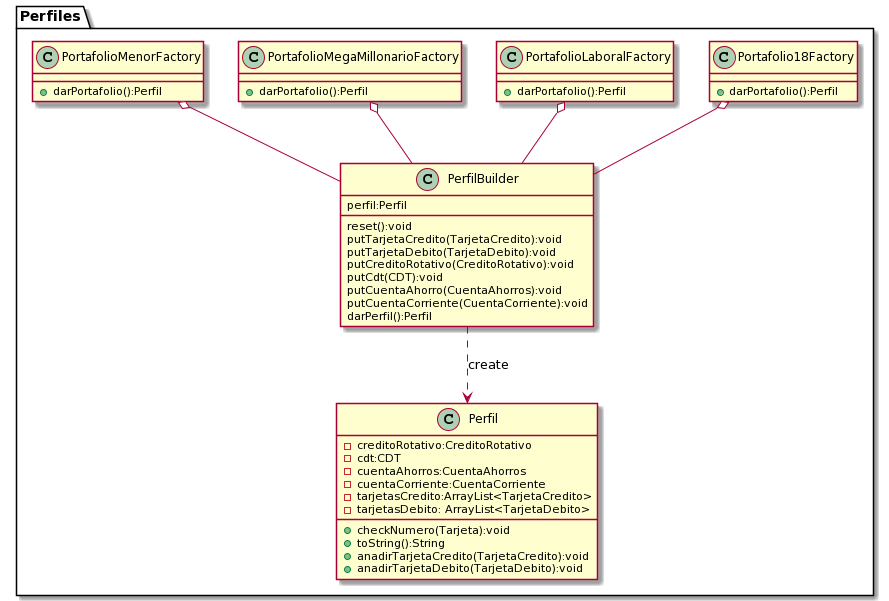
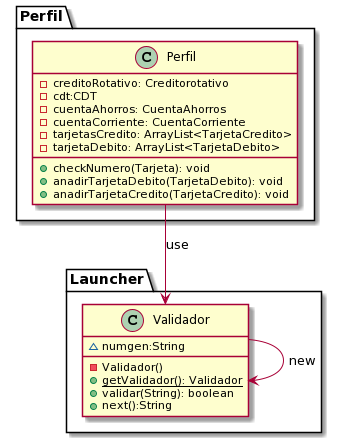

## PDUSA Bank

The bank has Created a portafolio according to its public, where according to the target public, it will offer a set of products with which it expectes to improve onboarding and customer retention.

### Clients profiles

18

> **Restriction/Specification:** people who have just turned 18 years old
>
> **Savings accounts:** True (enabled)
>
> **current accounts:** False (disabled)
>
> **Debit card:** with a transaction limit of $200.000
>
> **Credit card:** Basic card with a credit limit of $1.000.000
>
> **CDT:** will be available to initiate a 5 years deposit in which they can ass money and the minimum opening amount $1.000.000
>
> **Revolving credit:** disable ($0 to know about the existence of this)


laboral


> **Restriction/Specification:** people who belong to the laboral world
>
> **Savings accounts:** True (enabled)
>
> **current accounts:** True (enabled)
>
> **Debit card:** with a transaction limit of $2.000.000
>
> **Credit card:** Basic card with a credit limit of $3.500.000
>
> **CDT:** will be available to initiate a 5 years deposit in which they can ass money and the minimum opening amount $1.000.000
>
> **Revolving credit:** enable with a credit of $2.000.000


Menor


> **Restriction/Specification:** -
>
> **Savings accounts:** -
>
> **current accounts:** -
>
> **Debit card:** -
>
> **Credit card:** -
>
> **CDT:** -
>
> **Revolving credit:** -


Millonario


> **Restriction/Specification:** -
>
> **Savings accounts:** -
>
> **current accounts:** -
>
> **Debit card:** -
>
> **Credit card:** -
>
> **CDT:** -
>
> **Revolving credit:** -


|**Aditionals requirements**|
|---|
|The process of portafolio creation is always the same.|
|It must be possible to duplicate a product in case the customer requests another product of the same type.|
|The credit card validation process must be centralized, therefore only one instance must validate these numbers using Luhn's algorithm.|

## SOLID

### **S**ingle-responsibility principle

The class only has a simgle responsibility avoiding that besides creating the objetc, it also does the actions of the object.

```java
//code example
```

--**Explication**--

### **O**pen/closed principle

Try to add new code and do not modify the old one. for more security.

```java
//code example
```

--**Explication**--

### **L**iskov substitution principle

Any subclass must be able to be used as if it were the parent class

```java
//Code example
```

--**Explication**--

### **I**nterface segregation principle

Use by fragmentation of class or interfaces in order not ro modify a big class

```java
//Code example
```

--**Explication**--

### **D**ependency inversion principle

High-level modules should not depend on low-level modules, but should depend on interfaces.

```java
//Code example
```

--**Explication**--

## Patterns

### Factory pattern



The factory is used to create the bank service.

### Abstract Factory pattern

DIAGRAMA

Explicacion del uso

### Builder pattern



The builder builds the profiles by components. On the other hand, the factories od each profile will create the Profile attributes individually. 

### Singleton pattern



Validator is a unique instance that cannot be created mre than once, that is why the constructor has it private and the way to "use" or "create" it is through the function getValidador where the instance will be created but if it has already been created then it will return the validator. And leter it is used by the profile for the creation and verification of the card. 

### Prototype pattern

DIAGRAMA

Explicacion del uso

## Class diagram

diagramita


