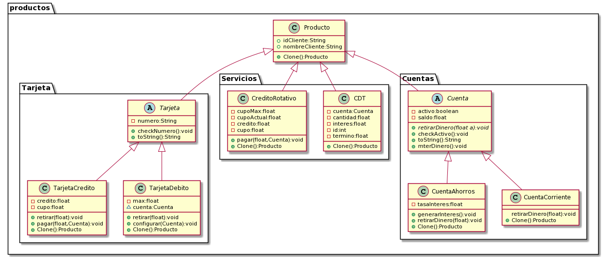

## PDUSA Bank

The bank has created a portafolio according to some public requierements, where according to the target public, it will offer a set of products with which it expectes to improve onboarding and customer retention.

### Clients profiles

18

> **Restriction/Specification:** People who have just turned 18 years old, or are close to being 18 years old
>
> **Savings accounts:** True (enabled)
>
> **current accounts:** False (disabled)
>
> **Debit card:** with a transaction limit of $200.000
>
> **Credit card:** Basic card with a credit limit of $1.000.000
>
> **CDT:** will be available to initiate a 5 years deposit in which they can get interest on a minimum deposit of 1,000,000
>
> **Revolving credit:** disabled ($0 to know about the existence of the product)


laboral


> **Restriction/Specification:** People who belong to the laboral world
>
> **Savings accounts:** True (enabled)
>
> **current accounts:** True (enabled)
>
> **Debit card:** with a transaction limit of $2.000.000
>
> **Credit card:** Basic card with a credit limit of $3.500.000
>
> **CDT:** will be available to initiate a 5 years deposit in which they can get interest on a minimum deposit of 1,000,000
>
> **Revolving credit:** enabled with a credit of $2.000.000


Menor


> **Restriction/Specification:** A minor who wishes to enter the financial world
>
> **Savings accounts:** True (enable)
>
> **current accounts:** False (disable)
>
> **Debit card:** with a transaction limit of $100.000
>
> **Credit card:** Disabled
>
> **CDT:** will be available to initiate a 2 years deposit in which they can get interest on a minimum deposit of 200,000
>
> **Revolving credit:** disable ($0 to know about the existence of this)


MegaMillonario


> **Restriction/Specification:** Person with a large amount of money 
> 
> **Savings accounts:** True (enable)
>
> **current accounts:** True (enable)
>
> **Debit card:** with a transaction limit of $20.000.000
>
> **Credit card:** Credit limit of $950.000.000
>
> **CDT:** will be available to initiate a 5 years deposit in which they can get interest on a minimum deposit of 100,000,000
>
> **Revolving credit:** enable with a credit of $2.000.000.000


|**Aditionals requirements**|
|---|
|The process of portafolio creation is always the same.|
|It must be possible to duplicate a product in case the customer requests another product of the same type.|
|The credit card validation process must be centralized, therefore only one instance must validate these numbers using Luhn's algorithm.|

## SOLID

### **S**ingle-responsibility principle

The class only has a simgle responsibility avoiding that besides creating the objetc, it also does the actions of the object.

```java
public class Portafolio18Factory implements IPortafolioFactory {
   
    public Portafolio darPortafolio(){
     //build Portafolio
     }
}
```

An example of this principle is the PortafolioFactory since it has a single responsibility to deliver a portafolio. Similarly, the ProductFactory also complies with this principle since the only responsibility it has is to deliver a certain Product

```java
public class CreditoRotativoFactory implements IProductoFactory{
    public Producto darProducto(){
        return new CreditoRotativo();
    }
    public Producto darProducto(String s){
        return new CreditoRotativo();
    }
    
}
```

### **O**pen/closed principle

Try to add new code and do not modify the old one. for more security.

```java
//Example code

public class PortafolioFactory {
     public IPortafolioFactory darFactory(String c){
        Map<String, IPortafolioFactory> map = new HashMap<String,  IPortafolioFactory>();
        map.put("18",new Portafolio18Factory());
        map.put("laboral",new PortafolioLaboralFactory());
        map.put("menor",new PortafolioMenorFactory());
        map.put("megaMillonario",new PortafolioMegaMillonarioFactory()); 
        return map.get(c);
    }
}
```

for the creation of a serice a map is usde to avoid violating the open/close principle using if's

### **L**iskov substitution principle

Any subclass must be able to be used as if it were the parent class

```java
public abstract class Tarjeta extends Producto  {
    private String numero = "";
    public Tarjeta(){}
    //...
    @Override
    public String toString() {
        return "Tarjeta{" + "numero=" + numero + '}';
    }
    
}

public class TarjetaCredito  extends Tarjeta{
    
    
    private float credito=0; //Total debido en positivo
    private float cupo=1000000;
    //...
    public Producto Clone() {
        return new TarjetaCredito(this);
    }
    
    
}

```

Each oh the products fulfills the Liskov substitution since all the subclasses behave like the class, since each product is defined and does not fall into errors due to generalizations.

### **I**nterface segregation principle

Use by fragmentation of class or interfaces in order not ro modify a big class

```java
public abstract class Producto {
    private boolean activo = false;
    public String idCliente;
    public String nombreCliente;
    //...
    public void checkActivo() {
        if (!this.isActivo()) {
            throw new ArithmeticException("La cuenta no esta activa!");

        }

    }
}
public abstract class Cuenta extends Producto {   
    private float saldo;
    //...
    public void meterDinero(float a) {
        this.checkActivo();
        
        if (a < 0) {
            System.out.println("ERROR: la cantidad a retirar no puede ser negativa");
        } else {
            this.setSaldo(this.getSaldo() + a);
        }

    }

}
public class CuentaAhorros extends Cuenta {

    private float tasaInteres;

    public void generarInteres() {
        this.checkActivo();
        this.setSaldo(this.getSaldo() * (1 + this.tasaInteres));
    }
    //...
    public CuentaAhorros Clone(){
        return new CuentaAhorros(this);
    }
}
```

The functionalities of the products are fragmented in order to reduce the size of the class to implement and on the other hand not to be using portions of a large function. In this case, we could create a large class for the products but we would incur in the violation of this principle, so we choose to fragment the product in each of its types (Card,Account,etc...), which in turn will be fragmented in the different type offered 

### **D**ependency inversion principle

High-level modules should not depend on low-level modules, but should depend on interfaces.

```java

public interface IPortafolioFactory {
    public Portafolio darPortafolio();
    
}

public class PortafolioFactory {
     public IPortafolioFactory darFactory(String c){
        Map<String, IPortafolioFactory> map = new HashMap<String,  IPortafolioFactory>();
        map.put("18",new Portafolio18Factory());
        map.put("laboral",new PortafolioLaboralFactory());
        map.put("menor",new PortafolioMenorFactory());
        map.put("megaMillonario",new PortafolioMegaMillonarioFactory()); 
        return map.get(c);   
    }   
}
```

In this case, we can observe the principle since PortafolioFactory does not depend on each big class but on an interface that relates it with the class for he creation of the services

## Patterns

### Factory pattern


The factory is used to create the bank service.

### Abstract Factory pattern


the abstract is used to create factories of service, where each profile will create this Profile attributes.

### Builder pattern
:


The builder builds the profiles by components. On the other hand, the factories od each profile will create the Profile attributes individually. 

### Singleton pattern


Validator is a unique instance that cannot be created mre than once, that is why the constructor has it private and the way to "use" or "create" it is through the function getValidador where the instance will be created but if it has already been created then it will return the validator. And leter it is used by the profile for the creation and verification of the card. 

### Prototype pattern



allows cloning services with the option to change attributes

## Class diagram


